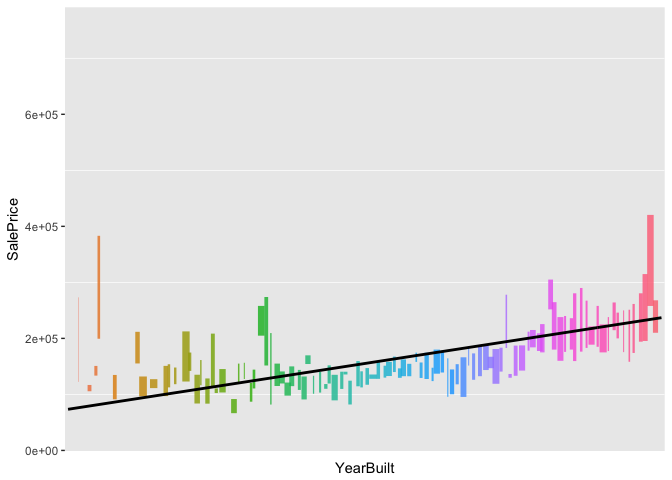

Kaggle Project : Boston Housing - Advanced Regression Techniques
================
Clobbe Norman
11/19/2017

1.What are we dealing with?
===========================

Need to clean up this bulletlist later + write an introduction to the case and thank Pedro Marcelino for the inspiration and [guidance on his approach to this project](https://www.kaggle.com/pmarcelino/comprehensive-data-exploration-with-python)

1.  **Understand the problem** We'll look at each feature and do a philosophical analysis about their meaning and importance for this problem.\*

2.  **Univariable study** We'll just focus on the dependent feature ('SalePrice') and try to know a little bit more about it.

3.  **Multivariate study** We'll try to understand how the dependent feature and independent features relate.

4.  **Basic cleaning** We'll clean the dataset and handle the missing data, outliers and categorical features.

5.  **Test assumptions** We'll check if our data meets the assumptions required by most multivariate techniques.

Pick up the right toolset
-------------------------

Meaning, importing the goodies from `tidyverse` for easy data wrangling, `ggplot2` for some nice visualization and `broom` for making sure we don't miss anything while creating our models later on.

``` r
require(ggplot2)
require(tidyverse)

df.test.raw <- read_csv('test.csv', col_names = T)
df.train.raw <- read_csv('train.csv', col_names = T)

df.test <- df.test.raw
df.train <- df.train.raw
```

Now let's have a look at the the data that we loaded into R.

``` r
df.train %>% 
  glimpse()
```

    ## Observations: 1,460
    ## Variables: 81
    ## $ Id            <int> 1, 2, 3, 4, 5, 6, 7, 8, 9, 10, 11, 12, 13, 14, 1...
    ## $ MSSubClass    <int> 60, 20, 60, 70, 60, 50, 20, 60, 50, 190, 20, 60,...
    ## $ MSZoning      <chr> "RL", "RL", "RL", "RL", "RL", "RL", "RL", "RL", ...
    ## $ LotFrontage   <int> 65, 80, 68, 60, 84, 85, 75, NA, 51, 50, 70, 85, ...
    ## $ LotArea       <int> 8450, 9600, 11250, 9550, 14260, 14115, 10084, 10...
    ## $ Street        <chr> "Pave", "Pave", "Pave", "Pave", "Pave", "Pave", ...
    ## $ Alley         <chr> NA, NA, NA, NA, NA, NA, NA, NA, NA, NA, NA, NA, ...
    ## $ LotShape      <chr> "Reg", "Reg", "IR1", "IR1", "IR1", "IR1", "Reg",...
    ## $ LandContour   <chr> "Lvl", "Lvl", "Lvl", "Lvl", "Lvl", "Lvl", "Lvl",...
    ## $ Utilities     <chr> "AllPub", "AllPub", "AllPub", "AllPub", "AllPub"...
    ## $ LotConfig     <chr> "Inside", "FR2", "Inside", "Corner", "FR2", "Ins...
    ## $ LandSlope     <chr> "Gtl", "Gtl", "Gtl", "Gtl", "Gtl", "Gtl", "Gtl",...
    ## $ Neighborhood  <chr> "CollgCr", "Veenker", "CollgCr", "Crawfor", "NoR...
    ## $ Condition1    <chr> "Norm", "Feedr", "Norm", "Norm", "Norm", "Norm",...
    ## $ Condition2    <chr> "Norm", "Norm", "Norm", "Norm", "Norm", "Norm", ...
    ## $ BldgType      <chr> "1Fam", "1Fam", "1Fam", "1Fam", "1Fam", "1Fam", ...
    ## $ HouseStyle    <chr> "2Story", "1Story", "2Story", "2Story", "2Story"...
    ## $ OverallQual   <int> 7, 6, 7, 7, 8, 5, 8, 7, 7, 5, 5, 9, 5, 7, 6, 7, ...
    ## $ OverallCond   <int> 5, 8, 5, 5, 5, 5, 5, 6, 5, 6, 5, 5, 6, 5, 5, 8, ...
    ## $ YearBuilt     <int> 2003, 1976, 2001, 1915, 2000, 1993, 2004, 1973, ...
    ## $ YearRemodAdd  <int> 2003, 1976, 2002, 1970, 2000, 1995, 2005, 1973, ...
    ## $ RoofStyle     <chr> "Gable", "Gable", "Gable", "Gable", "Gable", "Ga...
    ## $ RoofMatl      <chr> "CompShg", "CompShg", "CompShg", "CompShg", "Com...
    ## $ Exterior1st   <chr> "VinylSd", "MetalSd", "VinylSd", "Wd Sdng", "Vin...
    ## $ Exterior2nd   <chr> "VinylSd", "MetalSd", "VinylSd", "Wd Shng", "Vin...
    ## $ MasVnrType    <chr> "BrkFace", "None", "BrkFace", "None", "BrkFace",...
    ## $ MasVnrArea    <int> 196, 0, 162, 0, 350, 0, 186, 240, 0, 0, 0, 286, ...
    ## $ ExterQual     <chr> "Gd", "TA", "Gd", "TA", "Gd", "TA", "Gd", "TA", ...
    ## $ ExterCond     <chr> "TA", "TA", "TA", "TA", "TA", "TA", "TA", "TA", ...
    ## $ Foundation    <chr> "PConc", "CBlock", "PConc", "BrkTil", "PConc", "...
    ## $ BsmtQual      <chr> "Gd", "Gd", "Gd", "TA", "Gd", "Gd", "Ex", "Gd", ...
    ## $ BsmtCond      <chr> "TA", "TA", "TA", "Gd", "TA", "TA", "TA", "TA", ...
    ## $ BsmtExposure  <chr> "No", "Gd", "Mn", "No", "Av", "No", "Av", "Mn", ...
    ## $ BsmtFinType1  <chr> "GLQ", "ALQ", "GLQ", "ALQ", "GLQ", "GLQ", "GLQ",...
    ## $ BsmtFinSF1    <int> 706, 978, 486, 216, 655, 732, 1369, 859, 0, 851,...
    ## $ BsmtFinType2  <chr> "Unf", "Unf", "Unf", "Unf", "Unf", "Unf", "Unf",...
    ## $ BsmtFinSF2    <int> 0, 0, 0, 0, 0, 0, 0, 32, 0, 0, 0, 0, 0, 0, 0, 0,...
    ## $ BsmtUnfSF     <int> 150, 284, 434, 540, 490, 64, 317, 216, 952, 140,...
    ## $ TotalBsmtSF   <int> 856, 1262, 920, 756, 1145, 796, 1686, 1107, 952,...
    ## $ Heating       <chr> "GasA", "GasA", "GasA", "GasA", "GasA", "GasA", ...
    ## $ HeatingQC     <chr> "Ex", "Ex", "Ex", "Gd", "Ex", "Ex", "Ex", "Ex", ...
    ## $ CentralAir    <chr> "Y", "Y", "Y", "Y", "Y", "Y", "Y", "Y", "Y", "Y"...
    ## $ Electrical    <chr> "SBrkr", "SBrkr", "SBrkr", "SBrkr", "SBrkr", "SB...
    ## $ `1stFlrSF`    <int> 856, 1262, 920, 961, 1145, 796, 1694, 1107, 1022...
    ## $ `2ndFlrSF`    <int> 854, 0, 866, 756, 1053, 566, 0, 983, 752, 0, 0, ...
    ## $ LowQualFinSF  <int> 0, 0, 0, 0, 0, 0, 0, 0, 0, 0, 0, 0, 0, 0, 0, 0, ...
    ## $ GrLivArea     <int> 1710, 1262, 1786, 1717, 2198, 1362, 1694, 2090, ...
    ## $ BsmtFullBath  <int> 1, 0, 1, 1, 1, 1, 1, 1, 0, 1, 1, 1, 1, 0, 1, 0, ...
    ## $ BsmtHalfBath  <int> 0, 1, 0, 0, 0, 0, 0, 0, 0, 0, 0, 0, 0, 0, 0, 0, ...
    ## $ FullBath      <int> 2, 2, 2, 1, 2, 1, 2, 2, 2, 1, 1, 3, 1, 2, 1, 1, ...
    ## $ HalfBath      <int> 1, 0, 1, 0, 1, 1, 0, 1, 0, 0, 0, 0, 0, 0, 1, 0, ...
    ## $ BedroomAbvGr  <int> 3, 3, 3, 3, 4, 1, 3, 3, 2, 2, 3, 4, 2, 3, 2, 2, ...
    ## $ KitchenAbvGr  <int> 1, 1, 1, 1, 1, 1, 1, 1, 2, 2, 1, 1, 1, 1, 1, 1, ...
    ## $ KitchenQual   <chr> "Gd", "TA", "Gd", "Gd", "Gd", "TA", "Gd", "TA", ...
    ## $ TotRmsAbvGrd  <int> 8, 6, 6, 7, 9, 5, 7, 7, 8, 5, 5, 11, 4, 7, 5, 5,...
    ## $ Functional    <chr> "Typ", "Typ", "Typ", "Typ", "Typ", "Typ", "Typ",...
    ## $ Fireplaces    <int> 0, 1, 1, 1, 1, 0, 1, 2, 2, 2, 0, 2, 0, 1, 1, 0, ...
    ## $ FireplaceQu   <chr> NA, "TA", "TA", "Gd", "TA", NA, "Gd", "TA", "TA"...
    ## $ GarageType    <chr> "Attchd", "Attchd", "Attchd", "Detchd", "Attchd"...
    ## $ GarageYrBlt   <int> 2003, 1976, 2001, 1998, 2000, 1993, 2004, 1973, ...
    ## $ GarageFinish  <chr> "RFn", "RFn", "RFn", "Unf", "RFn", "Unf", "RFn",...
    ## $ GarageCars    <int> 2, 2, 2, 3, 3, 2, 2, 2, 2, 1, 1, 3, 1, 3, 1, 2, ...
    ## $ GarageArea    <int> 548, 460, 608, 642, 836, 480, 636, 484, 468, 205...
    ## $ GarageQual    <chr> "TA", "TA", "TA", "TA", "TA", "TA", "TA", "TA", ...
    ## $ GarageCond    <chr> "TA", "TA", "TA", "TA", "TA", "TA", "TA", "TA", ...
    ## $ PavedDrive    <chr> "Y", "Y", "Y", "Y", "Y", "Y", "Y", "Y", "Y", "Y"...
    ## $ WoodDeckSF    <int> 0, 298, 0, 0, 192, 40, 255, 235, 90, 0, 0, 147, ...
    ## $ OpenPorchSF   <int> 61, 0, 42, 35, 84, 30, 57, 204, 0, 4, 0, 21, 0, ...
    ## $ EnclosedPorch <int> 0, 0, 0, 272, 0, 0, 0, 228, 205, 0, 0, 0, 0, 0, ...
    ## $ `3SsnPorch`   <int> 0, 0, 0, 0, 0, 320, 0, 0, 0, 0, 0, 0, 0, 0, 0, 0...
    ## $ ScreenPorch   <int> 0, 0, 0, 0, 0, 0, 0, 0, 0, 0, 0, 0, 176, 0, 0, 0...
    ## $ PoolArea      <int> 0, 0, 0, 0, 0, 0, 0, 0, 0, 0, 0, 0, 0, 0, 0, 0, ...
    ## $ PoolQC        <chr> NA, NA, NA, NA, NA, NA, NA, NA, NA, NA, NA, NA, ...
    ## $ Fence         <chr> NA, NA, NA, NA, NA, "MnPrv", NA, NA, NA, NA, NA,...
    ## $ MiscFeature   <chr> NA, NA, NA, NA, NA, "Shed", NA, "Shed", NA, NA, ...
    ## $ MiscVal       <int> 0, 0, 0, 0, 0, 700, 0, 350, 0, 0, 0, 0, 0, 0, 0,...
    ## $ MoSold        <int> 2, 5, 9, 2, 12, 10, 8, 11, 4, 1, 2, 7, 9, 8, 5, ...
    ## $ YrSold        <int> 2008, 2007, 2008, 2006, 2008, 2009, 2007, 2009, ...
    ## $ SaleType      <chr> "WD", "WD", "WD", "WD", "WD", "WD", "WD", "WD", ...
    ## $ SaleCondition <chr> "Normal", "Normal", "Normal", "Abnorml", "Normal...
    ## $ SalePrice     <int> 208500, 181500, 223500, 140000, 250000, 143000, ...

Wow! That's impressive - 1,460 observations and 81 features.

From this quick overview of the dataset it seems like R interpret all the text varibles as `<chr>`, character features. Something which will mess up later when we want to build our model and doing some visualization.

Let's fix that by turning these characters into proper factors with levels instead.

``` r
df.test <- df.test %>% 
  unclass() %>% 
  as.data.frame()

df.train <- df.train %>% 
  unclass() %>% 
  as.data.frame()
```

Let's have a look now again at the features.

``` r
df.train %>%
  glimpse()
```

    ## Observations: 1,460
    ## Variables: 81
    ## $ Id            <int> 1, 2, 3, 4, 5, 6, 7, 8, 9, 10, 11, 12, 13, 14, 1...
    ## $ MSSubClass    <int> 60, 20, 60, 70, 60, 50, 20, 60, 50, 190, 20, 60,...
    ## $ MSZoning      <fctr> RL, RL, RL, RL, RL, RL, RL, RL, RM, RL, RL, RL,...
    ## $ LotFrontage   <int> 65, 80, 68, 60, 84, 85, 75, NA, 51, 50, 70, 85, ...
    ## $ LotArea       <int> 8450, 9600, 11250, 9550, 14260, 14115, 10084, 10...
    ## $ Street        <fctr> Pave, Pave, Pave, Pave, Pave, Pave, Pave, Pave,...
    ...
    ## $ SaleType      <fctr> WD, WD, WD, WD, WD, WD, WD, WD, WD, WD, WD, New...
    ## $ SaleCondition <fctr> Normal, Normal, Normal, Abnorml, Normal, Normal...
    ## $ SalePrice     <int> 208500, 181500, 223500, 140000, 250000, 143000, ...

*(yes, I intentionally cut the output so you didn't have to scroll as much again)*

Let's look at the features
--------------------------

``` r
df.train %>% 
  colnames() %>% 
  sort()
```

    ##  [1] "Alley"         "BedroomAbvGr"  "BldgType"      "BsmtCond"     
    ##  [5] "BsmtExposure"  "BsmtFinSF1"    "BsmtFinSF2"    "BsmtFinType1" 
    ##  [9] "BsmtFinType2"  "BsmtFullBath"  "BsmtHalfBath"  "BsmtQual"     
    ## [13] "BsmtUnfSF"     "CentralAir"    "Condition1"    "Condition2"   
    ## [17] "Electrical"    "EnclosedPorch" "ExterCond"     "Exterior1st"  
    ## [21] "Exterior2nd"   "ExterQual"     "Fence"         "FireplaceQu"  
    ## [25] "Fireplaces"    "Foundation"    "FullBath"      "Functional"   
    ## [29] "GarageArea"    "GarageCars"    "GarageCond"    "GarageFinish" 
    ## [33] "GarageQual"    "GarageType"    "GarageYrBlt"   "GrLivArea"    
    ## [37] "HalfBath"      "Heating"       "HeatingQC"     "HouseStyle"   
    ## [41] "Id"            "KitchenAbvGr"  "KitchenQual"   "LandContour"  
    ## [45] "LandSlope"     "LotArea"       "LotConfig"     "LotFrontage"  
    ## [49] "LotShape"      "LowQualFinSF"  "MasVnrArea"    "MasVnrType"   
    ## [53] "MiscFeature"   "MiscVal"       "MoSold"        "MSSubClass"   
    ## [57] "MSZoning"      "Neighborhood"  "OpenPorchSF"   "OverallCond"  
    ## [61] "OverallQual"   "PavedDrive"    "PoolArea"      "PoolQC"       
    ## [65] "RoofMatl"      "RoofStyle"     "SaleCondition" "SalePrice"    
    ## [69] "SaleType"      "ScreenPorch"   "Street"        "TotalBsmtSF"  
    ## [73] "TotRmsAbvGrd"  "Utilities"     "WoodDeckSF"    "X1stFlrSF"    
    ## [77] "X2ndFlrSF"     "X3SsnPorch"    "YearBuilt"     "YearRemodAdd" 
    ## [81] "YrSold"

We did some feature evaluation, tidious but very useful. It was done in a regular [Google Spreadsheet.](https://docs.google.com/spreadsheets/d/16RMnBO7TQLbaJIiphSrcFAlJq7ewtXyojskUUsE__FM/edit?usp=sharing)

From the initial evaluation with determine that some features are more interesting for houses and some for apartment houses.

By following the recommendation from previous author we grouped features into the three categories:

-   `building`

-   `location`

-   `space`

We then also evaluated how much influence each feature would have on the price. Classifying each feature with an expectation of either `Hi`, `Med` or `Low` influence.

The problem is getting more and more tangible and now it's just about validating wether the selected features indeed are positive correlated with an increase in price.

To get the overview and find which features that correlate with increased price it's convenient to do a matrix of plot who just take care of everything and give us an image with everything we're interested in.

### Features expected to have 'Hi' influence

 Looks like some of the features we expected to have high influence are positively correlated with the price. The highlighted features are:

-   `OverallQual` (*perhaps the most fluffy feature in this dataset - the overall quality of materials and finish*)

-   `YearBuilt` (*the year when the house was built*)

-   `YearRemodAdd` (*the year when the house last was remodule*)

-   `TotRmsAbvGrd` (*the number of rooms above grade (bathrooms not included)*)

2.What does target varible `SalePrice` look like
================================================

The scope for this project is to build a model that from a set of features (which we're currently trying to find) will be the basis for a model which in turn can predict the price - SalePrice.

Let's find out what we know about `SalePrice`.

``` r
df.train %>% 
  select(SalePrice) %>% 
  summary()
```

    ##    SalePrice     
    ##  Min.   : 34900  
    ##  1st Qu.:129975  
    ##  Median :163000  
    ##  Mean   :180921  
    ##  3rd Qu.:214000  
    ##  Max.   :755000

### First off - this looks perfect!

There's no zero's, meaning that the feature don't have any outliers that could later on affect our model.

Let's have a look at the distribution of `SalePrice`.

``` r
df.train %>% 
  ggplot(aes(x = SalePrice)) +
  geom_histogram(
      aes(y = ..density..),
      fill = 'blue',
      alpha = 0.4) +
  geom_density(alpha = 0, size = 1)
```

    ## `stat_bin()` using `bins = 30`. Pick better value with `binwidth`.


Seems like we're dealing with a right skewed distribution, meaning it's deviating from a good ole normal distribution.

Let's find out just how skewed the distribution is.

``` r
require(moments)
```

    ## Loading required package: moments

``` r
df.train %>% 
  select(SalePrice) %>% 
  summarise(
      Skewness = skewness(SalePrice),
      Kurtosis = kurtosis(SalePrice)
  )
```

    ##   Skewness Kurtosis
    ## 1 1.880941 9.509812

Let's dig deeper into the relationship
======================================

So up until now we've only looked at the relationship between `SalePrice` and numeric features. What about the categorical feature `OverallQual`? We already know that's it's related with `SalePrice` but not how much.

    ## Loading required package: RColorBrewer

``` r
df.train %>% 
  ggplot(aes(x = as.factor(OverallQual), y = SalePrice, fill = as.factor(OverallQual))) + 
    geom_boxplot(outlier.alpha = 0.3,
                 outlier.stroke = 0.5) +
  
    theme(panel.grid.major = element_blank(),
          legend.position="none") +
    
  xlab('OverallQual')
```


Well, this is nothing new but now we know how the `Overall Quality` is associated with `SalePrice`

Let's dig deeper on the second categorical feature

``` r
df.train %>% 
  ggplot(aes(x = as.factor(YearBuilt), y = SalePrice, fill = as.factor(YearBuilt))) + 
    geom_boxplot(alpha = 0.8,
                 outlier.alpha = 0.6,
                 position = 'jitter',
                 color = NA) +
  
    geom_smooth(aes(group=1),
                method = "lm",
                se=FALSE,
                color="black") +
  
  theme(panel.grid.major = element_blank(),
        legend.position="none",
        axis.ticks.x = element_blank(),
        axis.text.x = element_blank()) +
  
  xlab('YearBuilt')
```



#### Nice colors! But what does it tell us?

As seen above the black trendline helps us to determine that there is a positive association between `SalePrice` and feature `YearBuilt`.

### So to sum things up…

We've now found that:

-   `YearBuilt`, `OverallQual`, `YearRemodAdd` and `TotRmsAbvGrd` are all features that's lineraly related with `SalePrice` .

> *"But, hey! That's only 4 features out of 81 available. Don't you miss out on a lot of potential features that could have siginificant affect on the target?"*

In Pedro's guide he refer to that the trick for this particular case seems to be `feature selction` rather than `feature engineering`. And the selection of these features was soley based on intuition, in the next section we'll approach this problem a bit more objective as one should as an aspiring data scientist.

3.
==
